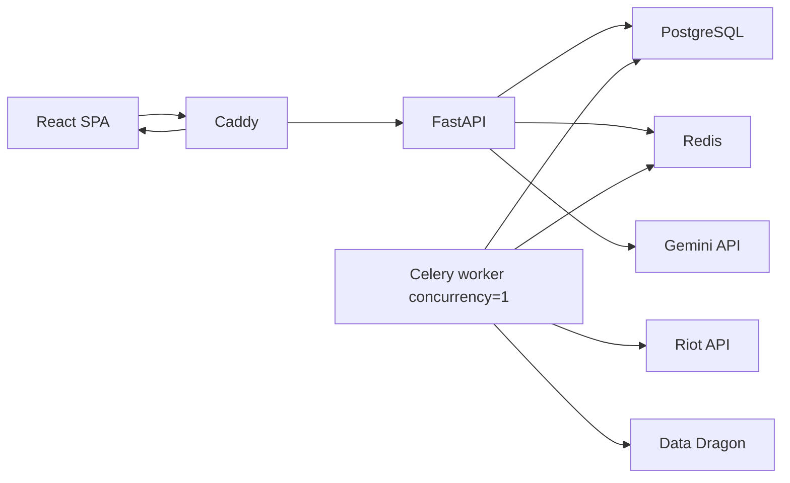
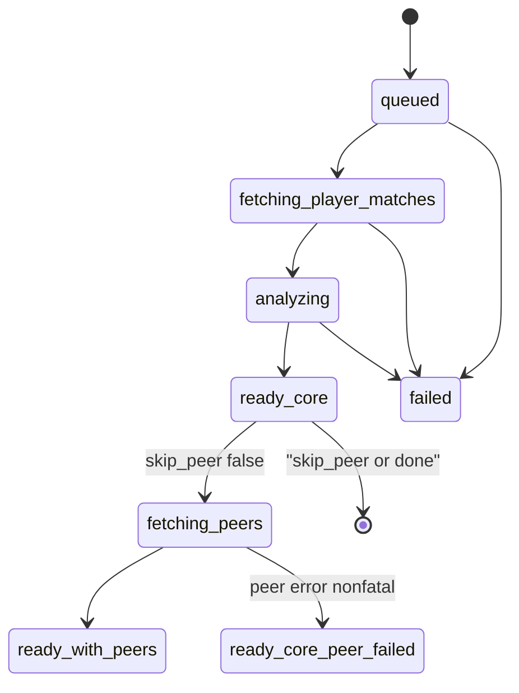

# Hosted Champion Stats Analyzer — Architecture Plan

## 1. Executive recommendation

| Layer | Choice | Why (for this repo) |
|-------|--------|---------------------|
| **Hosting (v1)** | **Hetzner Cloud VPS + Docker Compose** | Multi-GB match/timeline store (~3GB locally already; timelines ~0.9MB each), always-on worker for hour-scale Riot jobs, compose parity with local dev, lowest cost at low traffic. Revisit split (managed Postgres + second box) when public traffic or disk I/O hurts. |
| **Backend** | **FastAPI** | Repo already uses Pydantic v2; analysis stays in-process Python (pandas/scipy/sklearn); OpenAPI for the SPA; light enough vs Django (no auth/admin needed in v1). |
| **Frontend** | **React + Vite SPA** (not Next.js) | Current `report.html` is already a client-side mini-app (`applyView`, Game Review, Key Moments). No SEO/auth. `react-plotly.js` is the cleanest port of today’s Plotly figures. Serve as static files via Caddy/nginx next to the API. |
| **Database** | **PostgreSQL 16** | Concurrent API + worker writers; versioned report snapshots; replaces fragile multi-GB SQLite. Keep raw match/timeline payloads in Postgres (`BYTEA` compressed or `JSONB`) on the same VPS volume. |
| **Queue** | **Celery + Redis** | Long sync jobs (`requests` + `time.sleep` Riot client, pandas). **One Riot worker with `concurrency=1`** so the existing in-process [`RateLimiter`](src/league_stats/infra/riot_api.py) stays correct for a single `RIOT_API_KEY`. |
| **Auth (v1)** | **None** for reads/creates; **`OPERATOR_ADMIN_TOKEN`** header for refresh/delete | Matches “everyone sees the same library”; still blocks anonymous wipe/refresh abuse. |

**Not chosen (briefly):** Fly/Render/Railway — weaker fit for multi-GB disk + compose multi-service + long workers at this stage. Django — unused weight without auth/ORM legacy. HTMX — fights Game Review / Key Moments / queue×window swapping. ARQ — async-first while Riot client and analytics are sync; Celery is the boring fit. SQLite-only — concurrent writers + 3GB+ is a known pain (`MatchStore` today is single-process CLI).

---

## 2. Research comparisons (winners marked)

### Hosting

| Option | Fit | Verdict |
|--------|-----|---------|
| **VPS + Docker Compose (Hetzner/DO)** | Full control, cheap disk, always-on worker, identical local/prod compose | **Winner v1** |
| PaaS (Fly / Render / Railway) | Easy deploys; paid always-on workers; volumes awkward for multi-GB SQLite/Postgres growth; compose ≠ prod | Later / secondary |
| Managed Postgres + VPS app/worker | Good when DB size/ops grow | Phase 3 scale-out |

### Backend

| Option | Fit | Verdict |
|--------|-----|---------|
| **FastAPI** | Pydantic already in tree; OpenAPI; easy Celery side-by-side | **Winner** |
| Django + Ninja/DRF | Batteries useful for auth later; heavy for no-auth v1; migration tax | Skip |
| Litestar | Strong async/perf; smaller ecosystem; no clear win over FastAPI here | Skip |

### Frontend

| Option | Fit | Verdict |
|--------|-----|---------|
| **React + Vite** | Chart ecosystem (`react-plotly.js`), large hiring/docs surface, SPA behind Caddy | **Winner** |
| Vue / Nuxt | Equally capable; slightly less Plotly glue convention | Fine alternative, not default |
| HTMX + Jinja | Keeps Python templates; poor match for existing interactive JS surface | Reject for report viewer |
| Next.js | SSR unused (no SEO/auth); extra complexity | Reject |

### Database

| Option | Fit | Verdict |
|--------|-----|---------|
| **PostgreSQL** | Jobs, snapshots, match blobs, peer_games; concurrent safe | **Winner** |
| SQLite (current) | Great for CLI; bad for API+worker concurrency at GB scale | Migrate away as primary |
| Postgres + object storage (S3/MinIO) for timelines | Better when DB > tens of GB | Phase 3 if needed |
| Redis | Broker + job progress cache + submit rate limits — **not** primary store | Infra companion |

### Job queue

| Option | Fit | Verdict |
|--------|-----|---------|
| **Celery + Redis** | Sync Riot + CPU analytics; chains for core→peer; mature retries | **Winner** |
| ARQ | Nice with pure asyncio; Riot client is sync/`sleep` | Reject |
| Postgres SKIP LOCKED only | Fewer moving parts; weaker tooling for long jobs/progress | Reject as primary |
| Temporal | Excellent workflows; ops overkill for v1 | Reject |

---

## 3. Target architecture

### Package map (onto existing layers)

| New / changed | Role |
|---------------|------|
| `src/league_stats/api/` | FastAPI routes: library, jobs, reports, assets proxy, chat proxy, admin |
| `src/league_stats/worker/` | Celery app + tasks: `fetch_and_analyze_core`, `enrich_peers` |
| [`analysis/`](src/league_stats/analysis/), [`ingest/`](src/league_stats/ingest/), [`pipeline/bundles.py`](src/league_stats/pipeline/bundles.py), progression/game_review | **Keep** — pure domain |
| [`pipeline/orchestrator.py`](src/league_stats/pipeline/orchestrator.py) | **Refactor**: return snapshot dicts; stop writing `report.html`; split already exists via `skip_peer` / [`run_with_peer`](src/league_stats/pipeline/orchestrator.py) |
| [`infra/riot_api.py`](src/league_stats/infra/riot_api.py), rate limiter | **Keep** in worker process (single concurrency) |
| [`infra/cache.py`](src/league_stats/infra/cache.py) `MatchStore` | **Replace** with Postgres repository (same semantics: never re-download) |
| [`presentation/`](src/league_stats/presentation/) templates | **Deprecate**; keep [`graphs.py`](src/league_stats/presentation/graphs.py) → emit Plotly JSON; keep icons/brand helpers |
| [`cli/app.py`](src/league_stats/cli/app.py) | **Deprecate** user commands; optional `league-stats-admin` for migrations/assets only |
| `web/` | React + Vite app |

### Job state machine

Progress fields on `analysis_jobs`: `stage`, `message`, `matches_downloaded`, `matches_total_estimate`, `builds_done`, `builds_total`, `rate_limit_wait_until`, `error`.

**Two Celery tasks (chain):**
1. `fetch_and_analyze_core` — resolve accounts → download missing matches/timelines → `run_analysis(..., peer_comparison=None)` per build → write snapshot `kind=core`, status `ready_core`.
2. `enrich_peers` — `build_peer_comparison` per build (reuse store/file cache) → re-bundle peer sections + recommendations + `chatbot_stats` → write snapshot `kind=with_peers`, status `ready_with_peers` (overwrite current pointer).

UI may open reports at `ready_core`; peer panels show `peer_status: pending|ready|skipped|failed`.

### Data model (sketch)

- `players` — riot_id, tagline, puuid, region, platform
- `analysis_groups` — slug (`reports_group_slug`), display label, created_at
- `analysis_group_players` — M2M
- `analysis_jobs` — group_id, options JSON (count, min_games, champion, role, skip_peer), status/stage, progress, celery_id, created_at, updated_at
- `matches` / `timelines` — match_id PK, payload (compressed), same forever-cache rule
- `match_players` — (match_id, puuid)
- `peer_games` — port of current schema in [`cache.py`](src/league_stats/infra/cache.py)
- `builds` — group_id, champion, role, slug
- `report_snapshots` — build_id, kind (`core`|`with_peers`), version, `report_views`, `progression_views`, `game_review`, `export_summary`, `figures_json`, created_at
- `group_current_snapshots` — build_id → current snapshot_id (atomic pointer swap on peer upgrade)
- `http_cache` — optional Postgres/Redis TTL cache replacing diskcache for account/match-id pages

### Online vs offline

| Concern | Where |
|---------|--------|
| Riot fetch, parse, frames, bundles, peer sample, chart JSON | **Worker only** |
| List jobs/reports, get snapshot JSON, SSE/poll progress | **API** |
| Gemini chat | **API proxy** using stored `export_summary` (never ship key) |
| DDragon static PNGs | Disk volume + Caddy `/assets/` (worker runs `ensure_downloaded`) |

### API shape (report)

Prefer existing embedded blobs as HTTP JSON:

- `GET /api/library` — groups + job statuses (`ready_core` vs `ready_with_peers`)
- `POST /api/jobs` — body: players[], region, platform, options (rate-limited)
- `GET /api/jobs/{id}` — status + progress (poll); `GET /api/jobs/{id}/events` SSE optional
- `GET /api/groups/{slug}/builds` — build list
- `GET /api/groups/{slug}/builds/{build}/report` — `{ status, peer_status, report_views, progression_views, game_review, export_summary_available }`
- `POST /api/chat` — `{ group, build, messages }` → Gemini server-side
- `POST /api/admin/jobs/{id}/refresh|delete` — `Authorization: Bearer $OPERATOR_ADMIN_TOKEN`

### Chart strategy

Change [`graphs.py`](src/league_stats/presentation/graphs.py) `_div(fig)` → `fig.to_plotly_json()` (data + layout). SPA renders with `react-plotly.js`. Stop baking base64 into every figure where asset URLs work; keep data-URI fallback for offline edge cases. Death heatmap PNG can become a Plotly heatmap or static file under `/assets/graphs/{id}.png`.

### Peer stage design

- Default: peer on (solo queue only — same as today in orchestrator line ~210).
- `skip_peer` on create job skips task 2.
- Peer jobs share the same concurrency=1 worker (naturally lower priority if queued after core jobs, or use Celery priority: core > peer).
- Cold peer can hit hundreds of match GETs ([`benchmark_fetcher.py`](src/league_stats/analysis/peer/benchmark_fetcher.py) caps); surface `fetching_peers` + ETA honesty; failures leave core report up (`ready_core_peer_failed`).

### Abuse controls (no auth)

- Global: max concurrent jobs (e.g. 1–2 active Riot jobs — already serialized by worker)
- Per-IP: N new jobs / hour (Redis)
- Caps: max players per job (e.g. 5), max `match_count` (e.g. 500), reject duplicate in-flight identical group slug
- Destructive ops: admin token only
- Outbound allowlist: Riot + DDragon + Gemini only

### CLI deprecation

- Remove/stop documenting `analyze` / `fetch` / `report` as user entrypoints.
- One-shot migration script: import existing SQLite `matches`/`timelines`/`peer_games` → Postgres.
- Stop generating `output/reports/**/report.html`; hubs become the React library page.

### Local / prod compose

Services: `caddy`, `api`, `worker`, `beat` (optional), `postgres`, `redis`, `web` (build static → volume or bake into Caddy image).

---

## 4. Riot rate-limit and progressive reports

- Defaults today: **18 req/s**, **95 / 2 min** ([`AppConfig`](src/league_stats/core/config.py)) — treat as hard budget for the one worker.
- **Single Celery worker, `concurrency=1`**, all Riot-touching tasks on queue `riot` → existing `RateLimiter` remains correct; no Redis token-bucket required in v1.
- Stage 1 must still download **timelines** for tracked players (peer sampling does not need timelines).
- Stage 2 prefers warm `peer_games` / 7-day live benchmark files → often CPU-only upgrade.
- Snapshot pointer swap is atomic so readers never see half-upgraded peer JSON.
- Incremental refresh (admin): fetch only unknown match IDs (preserve MatchStore semantics), recompute builds, new core snapshot, then peer task again.

---

## 5. Migration plan (keep / wrap / rewrite / delete)

| Area | Action |
|------|--------|
| `analysis/**`, `ingest/**`, most of `pipeline/**` | **Keep** |
| `orchestrator.run_analysis` / `run_with_peer` | **Wrap/refactor** to snapshot writers, no HTML |
| `MatchStore` / `HttpCache` | **Rewrite** on Postgres (+ Redis TTL) |
| `RiotApiClient` / `RateLimiter` | **Keep** in worker |
| `presentation/templates/**`, static HTML hubs | **Delete** from happy path |
| `graphs._div` | **Rewrite** → Plotly JSON |
| `cli` user commands | **Deprecate** |
| Gemini in [`report.html`](src/league_stats/presentation/templates/report.html) | **Rewrite** as `/api/chat` |
| Existing SQLite DB | **Migrate once** via import script |

---

## 6. Phased roadmap

### Phase 0 — Foundations
Docker Compose, Postgres schema, Celery worker concurrency=1, Riot client wired, job state machine, FastAPI health + empty library, React shell + routing.
**Done:** `POST /jobs` enqueues noop→status visible in UI.
**Risk:** underestimating payload size — compress timelines early.

### Phase 1 — MVP usable product
New Analysis form (multi `Name#Tag`), fetch+core analyze, library list, build list, report shell consuming `report_views` (Performance tab cards + coaching; charts JSON), IP rate limits, admin refresh/delete token.
**Done:** submit → progress → open core report for eligible builds; matches never re-downloaded.
**Risk:** first full 500-match+timeline pull is slow — progress UX must show rate-limit waits.

### Phase 2 — Full coaching surface + peer
Form Tracker, Game Review, Key Moments scrubber, exports download, peer async enrichment + snapshot upgrade, DDragon `/assets`, chatbot proxy.
**Done:** feature parity with today’s dashboard; peer pending→ready without blocking core.
**Risk:** cold peer budget starving new user fetches — use Celery priority (core first) and peer caps already in fetcher.

### Phase 3 — Public readiness
Stronger abuse limits, backups (pg_dump + volume), monitoring (job failures, 429 rate), CDN for assets, docs for personal Riot key. Add auth/private reports **only if** abuse or privacy demands it.
**Done:** runbook + backup restore tested; hosting scale note (managed Postgres, second read-only API).

---

## 7. Open questions (non-blocking)

None that change the stack. Operator should confirm before deploy: **personal vs 24h-dev Riot key** (same architecture; personal key avoids daily rotation). Default plan assumes a stable personal/production key in server env.

---

## 8. First implementation slice (PR sequence)

1. **Compose skeleton** — Postgres, Redis, FastAPI hello, Celery worker echo task, Caddy, Vite React hello.
2. **Schema + Match repository** — port `matches`/`timelines`/`match_players`; import script from SQLite optional.
3. **Job API + UI form** — create job, poll status; worker runs `fetch_matches` only for one player.
4. **Core analyze → snapshot** — call refactored `run_analysis` with `peer_comparison=None`; `GET report` returns `report_views` without figures first.
5. **Plotly JSON + React Performance tab** — one chart end-to-end.
6. **Peer chain task** — upgrade snapshot; UI peer pending badge.
7. **Remaining tabs + chat proxy + admin token** — parity track.
