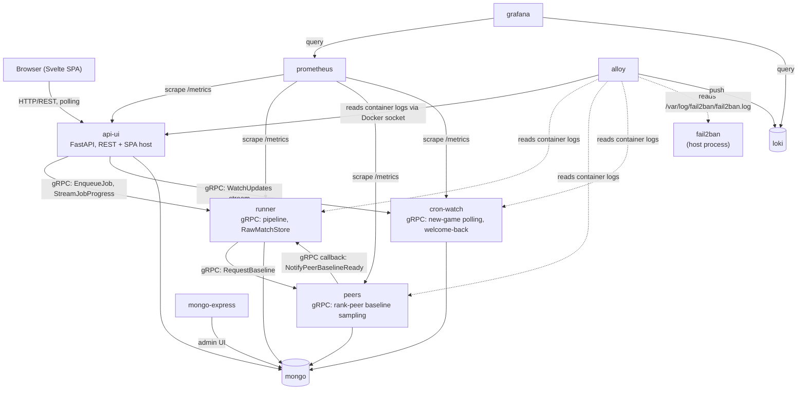

# League Champion Analyser

A production-quality coaching analyzer for **ranked queue** (solo/duo and flex), built on the Riot
**Match-V5** API. One run analyses **every champion + lane** you have played
enough (default: 20+ ranked games).

Optional **Gemini chatbot** side panel in reports (`GEMINI_API_KEY` in `.env`).
See [AGENTS.md](AGENTS.md) for AI contributor navigation.

This is not an OP.GG clone. It doesn't just describe *what* happened — it digs
into **why you win and why you lose**: death context, objective setups, reset
habits, build timings, matchup patterns, and statistically ranked coaching
recommendations.

## Features

- Downloads up to 500 ranked solo queue matches once (paged, cached, rate-limited,
  auto-retrying, with progress bars). A match is **never downloaded twice**
  (permanent MongoDB-backed store).
- Discovers every **champion + lane** pair with enough solo/duo games (default
  20+) and pre-generates a full report for each — Akali mid and Akali top are
  separate builds.
- Switch between builds instantly via a **dropdown** in each report (no runtime
  recompute).
- Full timeline analysis: gold/XP/CS checkpoints and lane differentials,
  inferred recalls (with unspent gold), roams, lane priority, wave-state proxy.
- Death forensics: zone, solo/outnumbered, greed, post-tower/objective,
  pre-dragon/baron, post-recall, bounty, shutdowns, heatmaps.
- Automatic teamfight detection (spatio-temporal kill clustering) with
  participation, damage, positioning and fight outcomes.
- Objective setup analysis for dragons, barons, heralds, grubs and elders.
- Vision, item build, rune and matchup analytics with per-setup win rates.
- Advanced statistics (scipy): correlation matrix, point-biserial win
  correlations, Fisher exact win-rate splits.
- Machine learning (scikit-learn): RandomForest early-game win predictor with
  cross-validated AUC and feature importances; KMeans game clustering with
  archetype labels (throws, comebacks, stomps...).
- **AI coach**: recommendations ranked by effect size × statistical
  significance × sample size.
- **Rank peer comparison**: your stats vs same-rank players on the same
  champion + lane, sampled live from league-v4 + match-v5 by the `peers`
  service (cached in MongoDB for 3 days).
- **Form Tracker**: compares your last 20 games vs games 21–100 (personal
  baseline) with statistical confidence, form score, behavioral shift detection,
  and diff-specific coaching tips. Precomputed per queue filter; independent of
  the Last 50/100 dashboard window toggle.
- A dark, responsive, interactive **HTML dashboard** plus CSV/JSON/Markdown
  exports.

## Setup

### 1. Get a Riot API key

1. Go to <https://developer.riotgames.com> and sign in with your Riot account.
2. Click **Regenerate API Key** on the dashboard. Development keys look like
   `RGAPI-xxxxxxxx-...` and expire every 24 hours (regenerate when needed).
3. Export it:

```bash
export RIOT_API_KEY="RGAPI-your-key-here"
```

For long-running use, apply for a **Personal API Key** on the same portal —
same rate limits, but it doesn't expire daily.

### 2. Install

Requires Python 3.12+ and [uv](https://docs.astral.sh/uv/):

```bash
uv sync
./deploy/build_spa.sh   # builds the Svelte SPA (required once, and after frontend changes)
```

Requires [Node.js](https://nodejs.org/) for `npm` (SPA build only).

### 3. Run the web app

All analysis runs through the browser UI:

```bash
uv run python main.py                       # http://127.0.0.1:8000
uv run python main.py --host 0.0.0.0 --port 8080
# equivalent:
uv run python -m league_stats_api_ui
```

This starts **api-ui** only — the HTTP/REST front door. The full system is
four cooperating services (see [Architecture](#architecture) below); running
just `main.py` against a local Mongo is fine for UI/report-browsing work, but
new-game detection (`cron-watch`), the analysis pipeline (`runner`), and peer
sampling (`peers`) need their own processes to actually produce reports — see
`docker-compose.yml` for the full stack.

Open the home page, enter a Riot ID (e.g. `YourName#EUW`), and submit. The app
queues the job (persisted in MongoDB), a background worker inside `api-ui`
delegates it to `runner` over gRPC, and the status page shows live progress
(queue position, download counts, ETA).

- Reports appear in **two stages**: the base dashboard first, then the rank-peer
  sections fill in automatically when peer sampling finishes.
- Already-analyzed players load instantly, with a **Refresh** button that only
  downloads new games.
- The Gemini chatbot is proxied through the server (`POST /api/chat`) — the API
  key is never embedded in web-served report HTML.
- All jobs share one Riot rate limit. With a dev key keep the default
  `worker_concurrency = 1`; raise it in `config.toml` under `[web]` once you have
  a production key:

```toml
[web]
host = "0.0.0.0"
port = 8000
worker_concurrency = 1
```

Optional defaults in `config.toml` next to `main.py` (region/platform used by
jobs when not chosen in the UI):

```toml
region = "europe"
match_count = 500
```

### Outputs

Each eligible build saves to **`output/reports/{player}/{champion_lane}/`**. Re-running
for the same summoner refreshes every eligible build.

Browse recent reports from the web home page, or open any **`report.html`** and
use the **sidebar build picker** to switch champions.

The report itself (old `report.json`), its per-build listing metadata (old
`meta.json`/`manifest.json`) and its derived exports (old `summary.json`,
`progression.json`/`progression.md`) are no longer files at all -- they are
stored in MongoDB (`league_stats_common.infra.report_store.ReportStore`,
collections `report_builds`/`report_bodies`) and served through
`GET /api/players/{slug}/builds/{build_slug}` and friends. What's left under
`output/reports/{player}/{champion_lane}/` is only what that migration left
out of scope:

| File | Content |
| --- | --- |
| `output/reports/.../recommendations.md` | Ranked coaching recommendations |
| `output/reports/.../{matches,deaths,...}.csv` | Flat tables for your own analysis |
| `output/reports/.../win_predictor.joblib` | Trained RandomForest model |
| `output/reports/.../graphs/death_heatmap.png` | Static per-phase death heatmaps |

## Architecture

The app is a set of independent services behind Docker Compose, each with its
own Riot API key so a slow pipeline run never starves fast polling or peer
sampling. There is no dual-mode/in-process fallback left anywhere: every
inter-service call is real gRPC, always (see "Interactions" below).



**A note on what this diagram deliberately does *not* draw:** the original
design sketch for this migration (see the migration design doc) assumed
`cron-watch` would call `runner`'s `EnqueueJob` RPC to dispatch new-match
jobs. That's not what got built — `cron-watch` writes new-match jobs
directly into the shared Mongo-backed `JobStore` (same collection `api-ui`
writes to for on-demand submissions); it never calls `runner` itself. It's
`api-ui`'s own background worker (`AnalysisWorker`, claiming rows from that
shared queue) that makes the real `EnqueueJob`/`StreamJobProgress` calls to
`runner`. The proto's RPC docstring still says "Called by CronWatch ... or
API-UI" — in the real system, only `api-ui` calls it.

Per-service breakdown:

- **api-ui** — FastAPI. Serves the built Svelte SPA and the REST API (see
  [Services and API reference](#services-and-api-reference) below). Runs the
  job queue's background worker (`AnalysisWorker`), which claims jobs from
  the shared Mongo `JobStore` and delegates every one to `runner` over gRPC
  — it never runs the pipeline itself. Subscribes to `cron-watch`'s
  `WatchUpdates` gRPC stream to cache welcome-back updates, served through
  the existing polled `/api/players/{slug}` endpoint (no browser-side
  streaming transport). Has no Riot API key.
- **cron-watch** — own Riot key, lightweight polling call pattern. Polls
  each watched player's match history for a new game; on detection, computes
  a fast "welcome back" summary itself (no timeline) and pushes it to
  `api-ui` over `WatchUpdates`, then enqueues a refresh job directly into the
  shared `JobStore`.
- **runner** — own Riot key, heavy match/timeline download call pattern.
  Houses the full pipeline (`league_stats_runner.pipeline/ingest/analysis/
  presentation`). On a job, fetches and persists the match/timeline to
  `RawMatchStore` (Mongo), then runs the pipeline in stages, pushing each
  stage's result to `api-ui` over `StreamJobProgress`. Calls `peers` for any
  champion+lane+rank baseline not already cached and receives the result via
  `NotifyPeerBaselineReady`.
- **peers** — own Riot key, league-wide sampling call pattern. Passive: only
  acts when `runner` calls `RequestBaseline`. Serves a cached baseline
  immediately when available; otherwise samples league-v4 + match-v5 in the
  background and calls back into `runner` when ready. All caches (peer-game
  rows and the live-sampling TTL cache) are Mongo-backed.
- **mongo** — single shared instance. Backs `JobStore`, `CareerStore`,
  `RawMatchStore`, `DerivedStore`, `PeerSampleStore`, `peer_match_samples`,
  and the live-benchmark cache. No SQLite anywhere in the app.
- **mongo-express** — a web UI onto the same `mongo` instance, for ad-hoc
  inspection. Loopback-only in `docker-compose.yml` (never reachable
  directly); only reachable through Caddy's `${DOMAIN}:8081` port-based site
  block (`deploy/run.sh`), Basic Auth-protected, credentials in `.env`
  (`ME_CONFIG_BASICAUTH_USERNAME`/`PASSWORD`).
- **prometheus** / **grafana** — pull-based metrics scraping
  (`deploy/prometheus.yml`) of each app service's `/metrics`, visualized in
  Grafana. Dashboards (one per app service — request/job/resolution rates,
  latency percentiles, CPU/memory, live logs — plus a `fail2ban` activity
  dashboard, see below) are provisioned automatically from
  `deploy/grafana/dashboards/`.
- **loki** / **alloy** — structured logging. `alloy` reads every container's
  stdout/stderr directly via the Docker socket (no per-service logging
  config needed) and pushes it to `loki`. Every log stream is tagged with a
  `service` label matching the same name Prometheus's `job_name`s use;
  api-ui/runner/peers/cron-watch's log lines additionally carry `trace_id`
  and `version` as Loki structured metadata (queryable via LogQL without the
  cardinality cost of using them as labels), read straight out of the
  `service`/`version`/`trace_id` tags every log line already carries (see
  `league_stats_common/utils.py::setup_logging`). Grafana's per-service
  dashboards each end with a live logs panel scoped to that service. `alloy`
  also tails fail2ban's own host log (`/var/log/fail2ban/fail2ban.log`,
  bind-mounted read-only) under a `service="fail2ban"` label, feeding the
  `fail2ban` dashboard's Ban/Unban/Found activity panels.
- **Caddy** (host systemd process, not a container — `deploy/run.sh`) is the
  public HTTPS front door. It fronts the main app on `${DOMAIN}` and Grafana
  / mongo-express on dedicated **ports** of that same domain
  (`${DOMAIN}:3000`, `${DOMAIN}:8081`) rather than subdomains — a port-based
  site block reuses the certificate already issued for `${DOMAIN}` (Caddy
  issues certs per hostname, not per port), so neither needs its own DNS A
  record. `microservice.${DOMAIN}` remains a real (transitional) subdomain,
  used only for side-by-side cutover testing against an old deployment still
  on `${DOMAIN}`.
  - Grafana logs failed admin logins to a mounted file
    (`GF_LOG_MODE=console file`), watched directly by a
    `deploy/fail2ban/` jail that permanently bans an IP after 10 failures.
  - mongo-express has no failed-login log of its own (just a plain HTTP 401),
    so its jail instead watches Caddy's own access log for the
    `${DOMAIN}:8081` site block (`/var/log/caddy/mongo-express-access.log`),
    matching 401 responses.
  - Either jail: `fail2ban-client set <grafana|mongo-express> unbanip <ip>`
    lifts a ban.

### Package layout

Code is split into six top-level packages under `src/`:

| Package | Contents |
| --- | --- |
| `league_stats_common/` | Cross-service code: config, Pydantic models, Riot API client, `JobStore`, `CareerStore` |
| `league_stats_api_ui/` | FastAPI app, REST routes, SPA host, chat proxy, `WelcomeBackSubscriber` |
| `league_stats_cron_watch/` | `WatchPoller`, `CronWatchServicer` |
| `league_stats_runner/` | The pipeline (`pipeline/`, `ingest/`, `analysis/`, `presentation/`), `RunnerServicer`, `RawMatchStore`, `AnalysisWorker` |
| `league_stats_peers/` | `PeersServicer`, peer sampling, `PeerSampleStore`, live-benchmark cache |
| `league_stats_rpc/` | Generated gRPC stubs from `protos/league_stats_rpc/v1/*.proto` |

Design principles (still hold inside `runner`'s pipeline, unchanged from the
original monolith):

- **Dependency injection** everywhere: the API client receives its cache and
  store, the parser its item catalogue, the coach its dataframes and
  statistics engine. `pipeline/services.py` builds the composition root.
- **Layered**: `infra/` (fetch/store) → `ingest/` (raw JSON → typed models) →
  `analysis/` (models → dataframes/summaries) → `presentation/` (graphs/report/export).
- **Typed and documented**: every function has type hints and a docstring;
  domain objects are Pydantic models.
- **Testable**: analysis code is pure (no I/O); the test suite runs on
  synthetic Match-V5 documents without network access.

## Services and API reference

### api-ui — REST (`src/league_stats_api_ui/app.py`)

| Method | Path | Description |
| --- | --- | --- |
| POST | `/api/analyses` | Submit a Riot ID (or group of Riot IDs) for analysis; validates region/min-games, verifies the account(s) exist, and enqueues an analyze job |
| GET | `/api/jobs/{job_id}` | Poll a job's current status/progress |
| POST | `/api/jobs/{job_id}/cancel` | Cancel a queued or in-progress job (existing base reports are kept) |
| GET | `/api/groups` | Report groups for the landing page |
| GET | `/api/activity` | Active jobs, for the landing page's status dots |
| GET | `/api/players/{slug}` | Player/job status, including the one-shot welcome-back payload and watch state |
| POST | `/api/players/{slug}/builds/{build_slug}/career/ack` | Mark a Career block-complete banner as seen |
| POST | `/api/players/{slug}/builds/{build_slug}/career/recap/ack` | Mark the "what's new" recap modal as seen up to one game |
| POST | `/api/players/{slug}/builds/{build_slug}/career/drop` | Discard one Career ladder block and queue a scoped regenerate to replace it |
| GET | `/api/players/{slug}/builds/{build_slug}` | Full report JSON payload for one build |
| POST | `/api/players/{slug}/refresh` | Fetch latest matches and re-analyse, optionally scoped to one champion+role |
| POST | `/api/players/{slug}/watch` | Enable auto-refresh polling for a group |
| DELETE | `/api/players/{slug}/watch` | Disable auto-refresh polling for a group |
| POST | `/api/players/{slug}/regenerate` | Re-render reports from already-cached matches, without fetching newer games |
| POST | `/api/players/{slug}/builds/{build_slug}/account-views` | Rebuild dashboard views for one account subset of a multi-player group report |
| POST | `/api/chat` | Gemini chatbot proxy for the report side panel (never exposes the API key to the browser) |
| GET | `/health` | Liveness check |
| GET | `/metrics` | Prometheus metrics (request duration/count); gated to private networks at the Caddy reverse-proxy layer in production |
| GET | `/riot.txt` | Riot Developer Portal domain-ownership verification |
| GET | `/{full_path}` | Catch-all: serves the Svelte SPA shell for client-side routes |

### runner — gRPC `RunnerService` (`protos/league_stats_rpc/v1/runner.proto`)

| RPC | Description |
| --- | --- |
| `EnqueueJob` | Start the pipeline for a job (called by `api-ui`'s `AnalysisWorker` today; the proto documents CronWatch as a caller too, but CronWatch does not call it in practice — see the architecture note above) |
| `StreamJobProgress` | Server-streamed pipeline stage results (fetch → analyze → peer, i.e. `job_states.FETCHING` → `ANALYZING`/`REPORT_READY` → `PEER_RUNNING`), subscribed to by `api-ui` |
| `NotifyPeerBaselineReady` | Callback `peers` uses to deliver a previously-requested baseline once ready |

### cron-watch — gRPC `CronWatchService` (`protos/league_stats_rpc/v1/cron_watch.proto`)

| RPC | Description |
| --- | --- |
| `RegisterAccount` | Register a Riot account for watch-polling (implemented server-side; no client in this codebase calls it today) |
| `ForceRefresh` | Force an immediate poll for one account (implemented server-side; no client in this codebase calls it today) |
| `WatchUpdates` | Server-streamed fast "welcome back" push the moment a new game is detected; subscribed to by `api-ui`'s `WelcomeBackSubscriber` |

### peers — gRPC `PeersService` (`protos/league_stats_rpc/v1/peers.proto`)

| RPC | Description |
| --- | --- |
| `RequestBaseline` | Request a champion+lane+rank peer baseline; returns it immediately if cached, otherwise responds `cached=false` and calls back into `runner`'s `NotifyPeerBaselineReady` once the live sample finishes |

## Known API limitations (documented heuristics)

The public Match-V5 API doesn't expose everything the ideal coach would want.
Where data is missing, the analyzer uses documented proxies or reports `None`:

| Metric | Status |
| --- | --- |
| Flash/summoner cooldowns at death | **Not available** — `flash_available` is always `None` |
| "Enemy seen before death" (fog of war) | **Not available** — `enemy_seen` is always `None` |
| Enemies hit by Chaos Storm | **Not available** — `enemies_hit_by_ult` is always `None` |
| Ultimate availability at death | Proxy: R learned by then (cooldown unknown) |
| Zhonya availability at death | Proxy: Zhonya/Stopwatch in inventory (cooldown unknown) |
| Recalls & unspent gold | Inferred from purchase clusters + frame gold |
| Positions (roams, presence, grouping) | Timeline frames are 60 s apart — coarse |
| Ward positions (blind spots, vision at death) | Not exposed — counts of recent team ward events are used |
| Wave states | Proxy from the player's own position (minions aren't in the API) |
| Participant ranks | Not in Match-V5 — rank comes from league-v4 at analysis time |
| Rank-peer averages | Sampled by the `peers` service from other players in your solo queue league playing the same champion + lane (league-v4 + match-v5). Mongo-backed cache, 3-day TTL. Early-game metrics (CS/gold @10, deaths pre-14) are omitted from the peer baseline because they require timelines. Same-champion players in your games are counted but not averaged — they are mostly your opponents. |
| Damage per teamfight | From kill events' `victimDamageReceived` (kills only) |

## Development

```bash
uv sync                     # install everything incl. dev group
uv run pytest               # run the test suite
uv run pytest --cov=.       # with coverage
```

Project layout is six top-level packages under `src/` — see
[Package layout](#package-layout) above. Most new analyses land in
`league_stats_runner/`: an `extract_*` (timeline-level) and/or aggregate
function in `analysis/<topic>.py`, wired in `pipeline/frames.py` and
`pipeline/orchestrator.py`.

*League Champion Analyser isn't endorsed by Riot Games and doesn't reflect the views or
opinions of Riot Games or anyone officially involved in producing or managing
League of Legends.*
