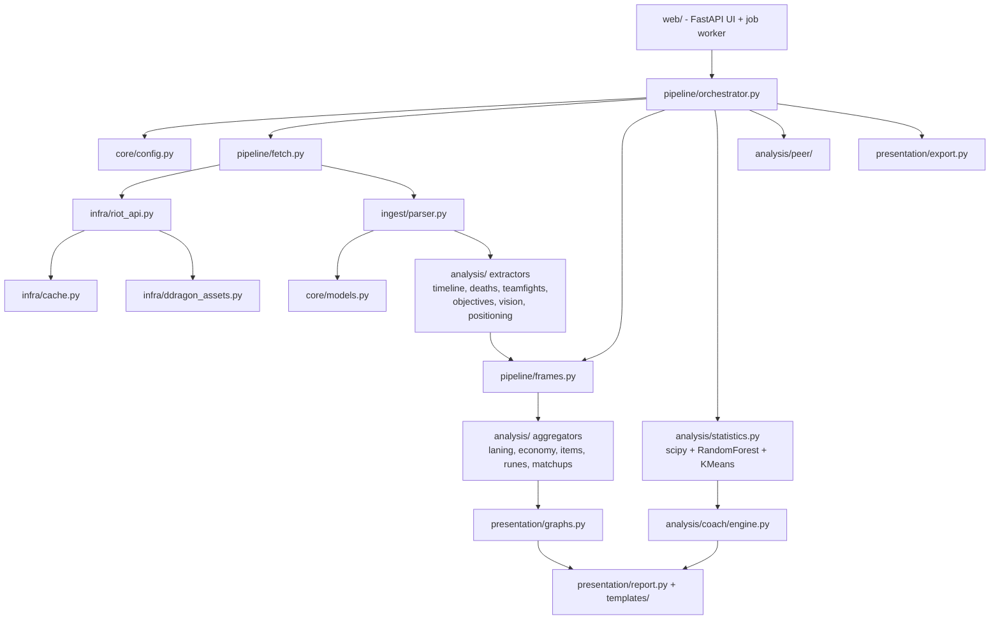

# League Champion Analyser

A production-quality coaching analyzer for **ranked queue** (solo/duo and flex), built on the Riot
**Match-V5** API. One run analyses **every champion + lane** you have played
enough (default: 20+ ranked games).

Optional **Gemini chatbot** side panel in reports (`GEMINI_API_KEY` in `.env`).
See [AGENTS.md](AGENTS.md) for AI contributor navigation.

This is not an OP.GG clone. It doesn't just describe *what* happened — it digs
into **why you win and why you lose**: death context, objective setups, reset
habits, build timings, matchup patterns, and statistically ranked coaching
recommendations.

## Features

- Downloads up to 500 ranked solo queue matches once (paged, cached, rate-limited,
  auto-retrying, with progress bars). A match is **never downloaded twice**
  (permanent MongoDB-backed store).
- Discovers every **champion + lane** pair with enough solo/duo games (default
  20+) and pre-generates a full report for each — Akali mid and Akali top are
  separate builds.
- Switch between builds instantly via a **dropdown** in each report (no runtime
  recompute).
- Full timeline analysis: gold/XP/CS checkpoints and lane differentials,
  inferred recalls (with unspent gold), roams, lane priority, wave-state proxy.
- Death forensics: zone, solo/outnumbered, greed, post-tower/objective,
  pre-dragon/baron, post-recall, bounty, shutdowns, heatmaps.
- Automatic teamfight detection (spatio-temporal kill clustering) with
  participation, damage, positioning and fight outcomes.
- Objective setup analysis for dragons, barons, heralds, grubs and elders.
- Vision, item build, rune and matchup analytics with per-setup win rates.
- Advanced statistics (scipy): correlation matrix, point-biserial win
  correlations, Fisher exact win-rate splits.
- Machine learning (scikit-learn): RandomForest early-game win predictor with
  cross-validated AUC and feature importances; KMeans game clustering with
  archetype labels (throws, comebacks, stomps...).
- **AI coach**: recommendations ranked by effect size × statistical
  significance × sample size.
- **Rank peer comparison**: your stats vs same-rank players on the same
  champion + lane, sampled live from league-v4 + match-v5 (cached for 7 days
  under `data/benchmarks/`).
- **Form Tracker**: compares your last 20 games vs games 21–100 (personal
  baseline) with statistical confidence, form score, behavioral shift detection,
  and diff-specific coaching tips. Precomputed per queue filter; independent of
  the Last 50/100 dashboard window toggle.
- A dark, responsive, interactive **HTML dashboard** plus CSV/JSON/Markdown
  exports.

## Setup

### 1. Get a Riot API key

1. Go to <https://developer.riotgames.com> and sign in with your Riot account.
2. Click **Regenerate API Key** on the dashboard. Development keys look like
   `RGAPI-xxxxxxxx-...` and expire every 24 hours (regenerate when needed).
3. Export it:

```bash
export RIOT_API_KEY="RGAPI-your-key-here"
```

For long-running use, apply for a **Personal API Key** on the same portal —
same rate limits, but it doesn't expire daily.

### 2. Install

Requires Python 3.12+ and [uv](https://docs.astral.sh/uv/):

```bash
uv sync
./deploy/build_spa.sh   # builds the Svelte SPA (required once, and after frontend changes)
```

Requires [Node.js](https://nodejs.org/) for `npm` (SPA build only).

### 3. Run the web app

All analysis runs through the browser UI:

```bash
uv run python main.py                       # http://127.0.0.1:8000
uv run python main.py --host 0.0.0.0 --port 8080
# equivalent:
uv run python -m league_stats.web
```

Open the home page, enter a Riot ID (e.g. `YourName#EUW`), and submit. The app
queues the job, downloads matches, and builds reports for every eligible
champion + lane.

- Submissions are queued (persisted in MongoDB) and processed by a background worker;
  the status page shows live progress (queue position, download counts, ETA).
- Reports appear in **two stages**: the base dashboard first, then the rank-peer
  sections fill in automatically when peer sampling finishes.
- Already-analyzed players load instantly, with a **Refresh** button that only
  downloads new games.
- The Gemini chatbot is proxied through the server (`POST /api/chat`) — the API
  key is never embedded in web-served report HTML.
- All jobs share one Riot rate limit. With a dev key keep the default
  `worker_concurrency = 1`; raise it in `config.toml` under `[web]` once you have
  a production key:

```toml
[web]
host = "0.0.0.0"
port = 8000
worker_concurrency = 1
```

Optional defaults in `config.toml` next to `main.py` (region/platform used by
jobs when not chosen in the UI):

```toml
region = "europe"
match_count = 500
```

### Outputs

Each eligible build saves to **`output/reports/{player}/{champion_lane}/`**. Re-running
for the same summoner refreshes every eligible build.

Browse recent reports from the web home page, or open any **`report.html`** and
use the **sidebar build picker** to switch champions.

| File | Content |
| --- | --- |
| `output/reports/{player}/index.html` | Redirect to default build (convenience entry) |
| `output/reports/{player}/manifest.json` | Build list metadata for the UI |
| `output/reports/.../report.html` | Interactive dark dashboard for one build |
| `output/reports/.../summary.json` | Every aggregate in machine-readable form |
| `output/reports/.../recommendations.md` | Ranked coaching recommendations |
| `output/reports/.../progression.json` | Form Tracker comparison (recent vs baseline) |
| `output/reports/.../progression.md` | Form Tracker human-readable summary |
| `output/reports/.../{matches,deaths,...}.csv` | Flat tables for your own analysis |
| `output/reports/.../win_predictor.joblib` | Trained RandomForest model |
| `output/reports/.../graphs/death_heatmap.png` | Static per-phase death heatmaps |

## Architecture



Design principles:

- **Dependency injection** everywhere: the API client receives its cache and
  store, the parser its item catalogue, the coach its dataframes and
  statistics engine. `pipeline/services.py` builds the composition root.
- **Layered**: `infra/` (fetch/store) → `ingest/` (raw JSON → typed models) →
  `analysis/` (models → dataframes/summaries) → `presentation/` (graphs/report/export).
- **Typed and documented**: every function has type hints and a docstring;
  domain objects are Pydantic models.
- **Testable**: analysis code is pure (no I/O); the test suite runs on
  synthetic Match-V5 documents without network access.

## Known API limitations (documented heuristics)

The public Match-V5 API doesn't expose everything the ideal coach would want.
Where data is missing, the analyzer uses documented proxies or reports `None`:

| Metric | Status |
| --- | --- |
| Flash/summoner cooldowns at death | **Not available** — `flash_available` is always `None` |
| "Enemy seen before death" (fog of war) | **Not available** — `enemy_seen` is always `None` |
| Enemies hit by Chaos Storm | **Not available** — `enemies_hit_by_ult` is always `None` |
| Ultimate availability at death | Proxy: R learned by then (cooldown unknown) |
| Zhonya availability at death | Proxy: Zhonya/Stopwatch in inventory (cooldown unknown) |
| Recalls & unspent gold | Inferred from purchase clusters + frame gold |
| Positions (roams, presence, grouping) | Timeline frames are 60 s apart — coarse |
| Ward positions (blind spots, vision at death) | Not exposed — counts of recent team ward events are used |
| Wave states | Proxy from the player's own position (minions aren't in the API) |
| Participant ranks | Not in Match-V5 — rank comes from league-v4 at analysis time |
| Rank-peer averages | Sampled from other players in your solo queue league playing the same champion + lane (league-v4 + match-v5). Cached for 7 days. Early-game metrics (CS/gold @10, deaths pre-14) are omitted from the peer baseline because they require timelines. Same-champion players in your games are counted but not averaged — they are mostly your opponents. |
| Damage per teamfight | From kill events' `victimDamageReceived` (kills only) |

## Development

```bash
uv sync                     # install everything incl. dev group
uv run pytest               # run the test suite
uv run pytest --cov=.       # with coverage
```

Project layout lives under `src/league_stats/` — one module per concern; new analyses
slot in as `analysis/<topic>.py` with an `extract_*` (timeline-level) and/or aggregate
function, wired in `pipeline/frames.py` and `pipeline/orchestrator.py`.

*League Champion Analyser isn't endorsed by Riot Games and doesn't reflect the views or
opinions of Riot Games or anyone officially involved in producing or managing
League of Legends.*
